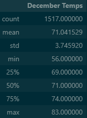

# Surfs_up Temperature Analysis
Module 9

## Overview

This analysis provides summary data for temperatures in the months of June and December to assist in the determination of location viability for a year-round surf and ice cream shop.  The analysis code can be found in SurfsUp_Challenge.ipynb. This report is supplemental to the analysis completed in climate_analysis.ipynb. 

## Results

- The dataset for June (1,700) was slightly larger than that of December (1,517). 

- The summary statistics show that December has slightly lower temperatures than June.  
  - The maximum temperature for June was 85°F and for December it was 83°F.
  - The minimum temperature for June was 64°F and for December it was 56°F.
  - Average temperatures were 75°F and 71°F for June and December, respectively. 
  - The majority of temperatures for both months were above 74°F. 
 
## Summary

Summary statistics for June and December show that, based on temperature, the viability of year-round surf and ice cream sales look promising. (see summary tables below) 

                                 

### Potential Additional Analysis

In moving forward with this venture, there are a few additional analyses that may be considered.    

- Determine what the minimum temperature is for surfing based on W. Avy's expertise. Filter the data based upon >= that temperature for the months of interest.
- Determine what is an acceptable level of precipitation for surfing and filter data based on <= that amount for the months of interest. 
- Similar analysis could be performed for ice cream sales, but most people may still eat ice cream in the temperature ranges found in the summary statistics, so this may   not be as useful.  
